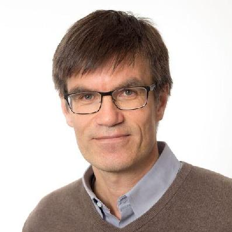
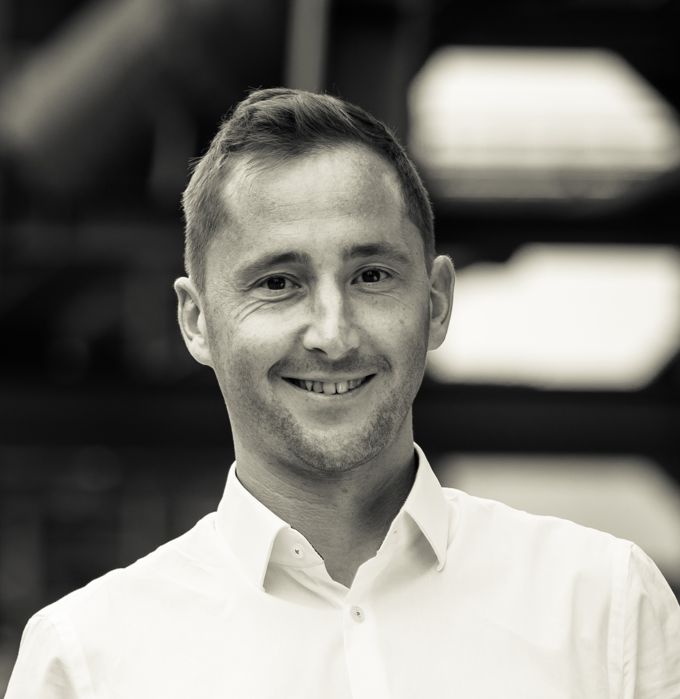
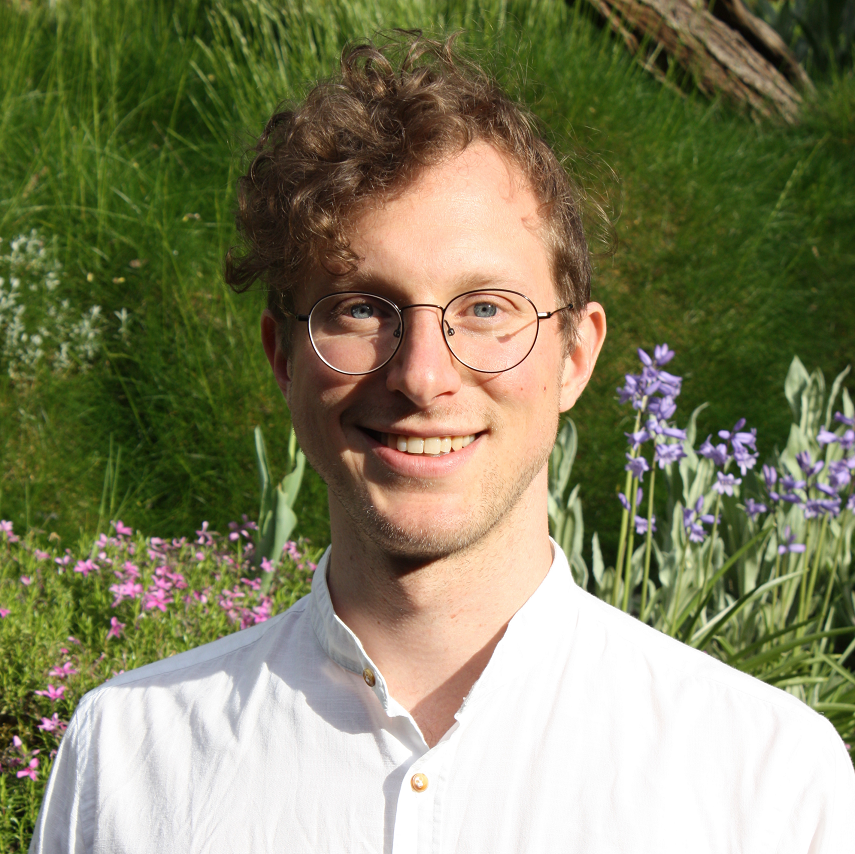
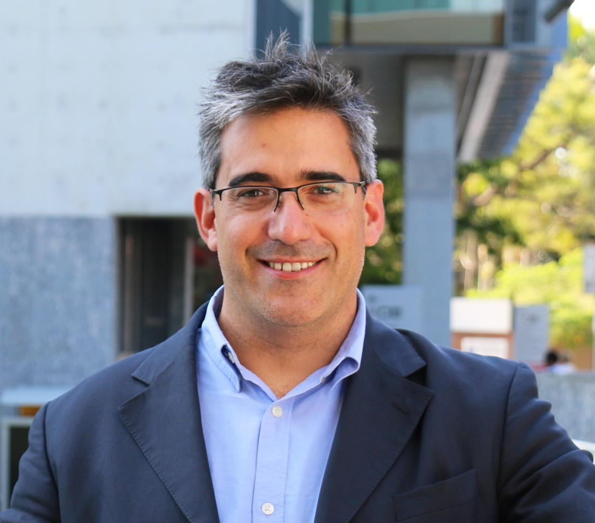

 
<h3 align="center">
  <a href="https://docs.google.com/forms/d/e/1FAIpQLSegqE_srBeCVRJyyzYTrg0mcZAQsLEN1gQThHxMP2hL7_fXgQ/viewform?usp=header" style="font-size: 1.2em; font-weight: bold; background-color: #cf5c04; padding: 15px 30px; border-radius: 8px; text-decoration: none; color: white;">
    Call for Contributions
  </a>
</h3>
 

## Aim of the workshop

The **4th Workshop on Intelligent and Automated Waterway Transportation**, which will take place on November 18th, 2025 at the [28th IEEE International Conference on Intelligent Transportation Systems](https://ieee-itsc.org/2025/) in Gold Coast, Australia, aims to foster technical and scientific exchange between academia, industry, and public authorities in the rapidly evolving fields of autonomous waterborne transportation and smart intermodal logistics. It serves as a platform to present and discuss recent advancements in intelligent and automated systems for inland, coastal and off-shore maritime transportation. Key topics include autonomous vessel development, advanced assistance systems, modeling and simulation, digital twins for waterways, navigation and control strategies, as well as automation of cargo handling. By bringing together experts from research institutions, industry leaders, consultants, and regulatory bodies, the workshop encourages interdisciplinary dialogue and collaboration. As an integral part of the broader Intelligent Transport Systems (ITS) community, the workshop emphasizes the role of autonomous shipping in shaping the future of transportation. 
Presentations by [invited experts](#invited-experts) will provide exciting insights into recent research achievements and innovative projects. Additionally, researchers will have the opportunity to present their work and connect with peers during the poster session. 

Interested in contributing? Submit your abstract [here](https://docs.google.com/forms/d/e/1FAIpQLSegqE_srBeCVRJyyzYTrg0mcZAQsLEN1gQThHxMP2hL7_fXgQ/viewform?usp=header).

## Workshop schedule

<table style="text-align:left;"> <tr><th>Time</th><th>Title</th><th>Speaker</th><th>Affiliation</th><th>Type</th></tr><tbody> 
  <tr><td>08:30–08:40</td><td>Opening</td><td>Dr. Philipp Sieberg</td><td>Schotte Automotive, Germany</td><td>Organization</td></tr> 
  <tr><td>08:40–09:05</td> <td>Towards Advanced Decision-Making Support for Shipping Safety: A Functional Connectivity Analysis</td> <td>Dr. Shiqi Fan (TBC) </td> <td>Wuhan University of Technology, China</td> <td>Invited expert's presentation</td> </tr>
  <tr><td>09:05–09:30</td> <td>Human, Machine, and the Sea: Rethinking Human Factors in Maritime Automation</td> <td>Dr. Magnus Liebherr (TBC) </td> <td>University of Duisburg-Essen, Germany</td> <td>Invited expert's presentation</td> </tr> 
  <tr><td>09:30–09:55</td> <td>Test, Evaluation &amp; Assurance of Autonomous System Capabilities</td> <td>Dr. Tristan Perez (TBC)</td> <td>The Boeing Company, Australia</td> <td>Invited expert's presentation</td> </tr> 
  <tr><td>09:55–10:05</td> <td align="center" colspan="4"><em>Lightning Talks by Poster Contributors</em></td> </tr> 
  <tr><td>10:05–10:30</td> <td align="center" colspan="4"><em>Poster Session</em></td> </tr> 
  <tr><td>10:30–11:00</td> <td align="center" colspan="4"><em>Coffee Break &amp; Poster Session (cont.)</em></td> </tr> 
  <tr><td>11:00–11:25</td> <td>Autonomous Vehicles: Where Learning Meets Control</td> <td>Dr. Andreas Malikopoulos</td> <td>Cornell University, USA</td> <td>Invited expert's presentation</td> </tr> <tr>
  <td>11:25–11:50</td> <td>Optimized Lock Scheduling with Methods of Reinforcement Learning</td> <td>Tom Legel</td> <td>Federal Waterways Engineering and Research Institute, Germany</td> <td>Invited expert's presentation</td> </tr> <tr>
  <td>11:50–12:25</td> <td align="center" colspan="4"><em>Panel Discussion</em> (Moderation: Dr. Frederic Kracht, Development Centre for Ship Technology and Transport Systems, Germany) </td> </tr> 
  <tr>
    <td>12:25–12:30</td> <td>Closing</td> <td>Dr. Hanna Krasowski</td> <td>UC Berkeley, USA</td> <td>Organization</td> </tr> 
</tbody></table>

Please note: This schedule is tentative and subject to change.

## Invited experts

<!-- ### [Dr. Asgeir Sørensen](https://www.ntnu.edu/employees/asgeir.sorensen)

Asgeir obtained his PhD degree in Engineering Cybernetics at NTNU in 1993. In 1989-1992 Asgeir was employed at MARINTEK (SINTEF) as Research Scientist. Since 1999 Asgeir has held the position of Professor of Marine Control Systems at the Department of Marine Technology, NTNU (Norway). He is currently acting as key scientist and the Director of the NTNU VISTA CAROS. Asgeir has together with colleagues established the Marine Cybernetics Laboratory (MC-Lab) and the Applied Underwater Robotics Laboratory (AUR-Lab), both at NTNU. Asgeir is engaged in bringing fundamental research results into value creation by innovations and entrepreneurships.  

_Title of talk: The influence of green shift in shipping affecting control system designs for guidance, navigation and control systems_
-->

### [Dr. Andreas Malikopoulos](https://www.engineering.cornell.edu/people/andreas-malikopoulos/)

Andreas is a Professor in the School of Civil & Environmental Engineering and the Director of the Information and Decision Science Lab at Cornell University. He received a Diploma from the National Technical University of Athens, Greece, and his M.S. and Ph.D. degrees from the University of Michigan, Ann Arbor, in 2004 and 2008, respectively, all in Mechanical Engineering. His research interests are grounded at the intersection of learning and control to enable systems—whether vehicles, robots, or large-scale infrastructures—to operate autonomously and achieve near-optimal performance while safely adapting to and interacting with dynamic environments. His work integrates decision-theoretic foundations with learning-based methods to endow engineered systems with the capability to reason, learn, and act in real time.

_Title of talk: Autonomous Vehicles: Where Learning Meets Control_

<!-- ### [Dr. Daniel Medina](https://www.linkedin.com/in/eng-daniel-medina)

Daniel received the B.Eng. in the field of Electrical Engineering 2011 from University of Malaga in 2014, and the M. Sc. and PhD from University Carlos III de Madrid (UC3M) in 2016 and 2022, respectively. He is currently a research fellow at the Institute of Communications and Navigation of the German Aerospace Center (DLR), where he leads the Multi Sensor Systems research group, dedicated to the provision of perception and navigation solutions with applications to intelligent transport and autonomous systems. His research interests include signal processing, robust filtering and estimation theory with applications to satellite-based navigation and SLAM. He is an Associate Editor for the IEEE Transactions on Intelligent Transportation Systems and currently serves as the elected Chair for the IEEE ITSS German Chapter.

_Title of talk: Reliable and Precise Perception and Navigation based on Multimodal Sensing for Inland Waterways_
-->

### [Dr. Magnus Liebherr](https://www.linkedin.com/in/magnus-liebherr-259335183)

Magnus is a cognitive psychologist and expert in human factors and automation. He leads the "Human-Factors and Cognition" group at the chair of mechatronics, University of Duisburg-Essen (Germany), where his work bridges psychology, engineering, and digital transformation. Magnus has been involved in numerous interdisciplinary research projects across domains such as mobility, logistics, and digital health, and has successfully acquired substantial third-party funding from national and European programs. He was awarded a prestigious postdoctoral fellowship at the Karolinska Institutet in Stockholm, reflecting the international recognition of his work. His current projects aim to understand how humans adapt cognitively and emotionally in increasingly automated and AI-driven environments—a perspective he brings into large-scale research initiatives and international collaborations that actively shape the evolving research landscape. 	 

_Title of talk: Human, Machine, and the Sea: Rethinking Human Factors in Maritime Automation_

### [Dr. Shiqi Fan](https://www.linkedin.com/in/shiqi-fan-b317658b)

Shiqi, a professor at the School of Transportation and Logistics, Wuhan University of Technology, specialises in maritime human factors and safety. Holding PhD in Maritime Engineering from Liverpool John Moores University, her work advances data-driven risk modelling and the application of neuroimaging techniques in maritime human factors. She has led work packages under the European Research Council funded TRUST project and Marie Skłodowska-Curie actions ENHANCE, focusing on decision-making and human performance in maritime operations. Shiqi is a Chartered Engineer (CEng), Chartered Marine Engineer (CMarEng) and member of the Institute of Marine Engineering, Science and Technology (MIMarEST).	 

_Title of talk: Towards advanced decision-making support for shipping safety: A functional connectivity analysis_

### Tom Legel

 Tom works at the Federal Waterways Engineering and Research Institute (BAW) in the department for Hydraulic Engineering in Inland Areas. He holds a Bachelor's degree in Mathematics from Humboldt University of Berlin and previously worked in Business Intelligence consulting from 2018 to 2021. To deepen his understanding of complex data processing, he pursued a degree in Computer Science at the Baden-Wuerttemberg Cooperative State University (DHBW) in Karlsruhe, with BAW as his dual partner. His work focuses on the analysis of traffic-related data, particularly data from the Automatic Identification System (AIS), to promote safety and efficiency in inland navigation using machine learning techniques. 

_Title of talk: Optimized lock scheduling with methods of Reinforcement Learning_

### [Dr. Tristan Perez](https://au.linkedin.com/in/tristan-perez-phd-b463584)

 Tristan is a distinguished expert in the field of autonomy and robotics. Originally from Argentina, he pursued his studies in Electrical and Control Engineering, laying a strong foundation for his future endeavours. Tristan further advanced his credentials by completing a PhD in Control Theory at the University of Newcastle in Australia.
Currently, he serves as the Chief Scientist for Autonomy Capabilities in the Boeing CTO Office, where he plays a pivotal leadership role to autonomy projects across the Boeing enterprise. His expertise encompasses the test, evaluation, and assurance of autonomous systems, with a particular focus on autonomous systems behaviours and mission assurance.
Prior to his tenure at Boeing, Tristan was a Professor of Robotics and Autonomous Systems, where he contributed significantly to the academic community. With over 25 years of technical experience, he possesses a unique blend of skills in system theory, artificial intelligence, robotics, and automation. His solid track record includes numerous contributions to industry products and collaborations with defence and government sectors, underscoring his commitment to advancing the field of autonomous systems.

_Title of talk: Test, Evaluation & Assurance of Autonomous System Capabilities_

## Expected participation

Members of industry, research, consultancy and public authorities in the field of autonomous shipping, intelligent water-based logistics and related topics are the the target audience of this workshop. If you do not belong to this target audience, but are interested in the workshop's subject, do not hesitate to join us! 
Please make sure to [register](https://ieee-itsc.org/2025/attend/registration/) for the ITSC Workshop Day in order to be able to participate. 

## Organizers

* [Dr. Philipp Sieberg](https://www.linkedin.com/in/dr-philipp-sieberg-1a21bb199/?originalSubdomain=de), Schotte Automotive GmbH & Co. KG., Germany & University of Duisburg-Essen, Germany
* [Dr. Hanna Krasowski](https://hanna.krasowski.io/), University of California, Berkeley, CA, United States 
*	[Kathrin Donandt](https://www.uni-due.de/srs/person.php?Id=147)[^1], University of Duisburg-Essen & Federal Waterways Engineering and Research Institute, Germany
* [Dr. Frédéric Etienne Kracht](https://www.linkedin.com/in/frederickracht), Development Center for Ship Technology and Transport Systems e. V. (DST), Germany

[^1]: [contact person](mailto:kathrin.donandt@web.de?subject=IEEEITSCWorkshop)

 
 

  
  <!-- Left -->
  

  <!-- Center -->
  

  

  <!-- Right -->
  

